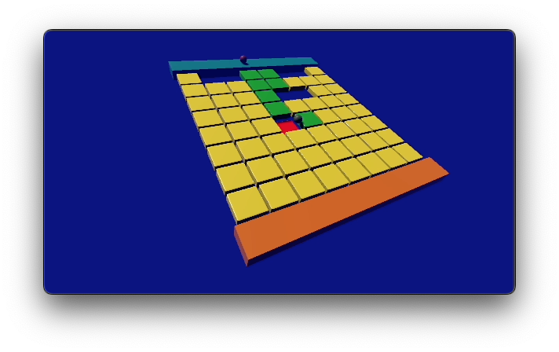

## You will make

Create a two-player game where each player must try to find the safe route across the tiles first. If a player rolls on the wrong tile, then they will fall through the floor!

You will:

+ Control two players with different keys on the keyboard.
+ Control the gravity of GameObjects with code.
+ Change the material of a GameObject using code.

--- no-print ---

Control the movement of Player One using <kbd>WASD</kbd> (or <kbd>ZQSD</kbd>). Player Two is controlled using the arrow keys. Try to find the safe route across the tiles before the other player!  

<iframe allowtransparency="true" width="710" height="500" scrolling = "no" src="https://raspberrypilearning.github.io/unity-webgl/DontFallThrough" frameborder="0"></iframe>

--- /no-print ---

--- print-only ---

--- /print-only ---

### You will need

This project requires the Unity Editor, which can be installed from the Unity Hub. This is a large download and install, so we recommend you install it before starting this project.

You can follow our [Unity guide](https://projects.raspberrypi.org/en/projects/unity-guide){:target="_blank"} to install the Unity Hub and the Unity Editor for your operating system.

You will also need to download the [More Unity starter package](https://rpf.io/p/en/rainbow-run-go){:target="_blank"} of assets before starting.
