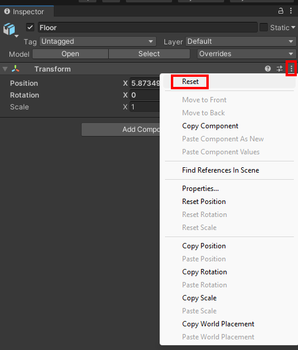

## Create the level

In this step you will create the level for your game. 

{:width="300px"}

Pathfinding games that use traps challenge your skills and make you think how to navigate the twists and turns. Overcoming hazards rewards players with a sense of accomplishment. This is nothing new. Trench Football was a popular wooden marble rolling game created in 1915 that used holes in the corners of turns along the pathway.

### Create a project with the starter package

--- task ---

Launch the Unity Hub and click **Projects** then select **New project**:

From the list choose **All templates** then select **3D Core**:

Edit the project settings to give your project a sensible name and save it to a sensible location. Then click **Create project**:

Your new project will open in the Unity Editor. It may take some time to load.

--- /task ---

--- task ---

The Unity starter package you downloaded for this More Unity path contains a number of **Assets** for you to use in your project.

To import them into your new project, click on the **Assets menu** and select **Import package > Custom Package…** then navigate to the downloaded Unity starter package.

--- collapse ---
---
title: I haven't downloaded a Unity starter package
---

Download and unzip the [More Unity starter package](https://rpf.io/p/en/rainbow-run-go){:target="_blank"} to your computer. 

**Tip:** Choose a sensible location such as your Documents folder. 

--- /collapse ---

[[[unity-importing-a-package]]]

--- /task ---

--- task ---

Right-click on **SampleScene** in the Hierarchy and choose **Save Scene As**: 

In the pop-up window, name your Scene `Don't fall through`:

A new file will appear in the Assets folder in the Project window:

--- /task ---

### Set up the level

--- task ---

In the Project window, click on **Parts**.

**Drag** the 'Floor' object to the Scene view: 

Your scene should look like this:

--- /task ---

--- task ---

Go to the Inspector window. Click on the Transform component menu and select 'Reset'. This will centre your floor in the world:

--- /task ---

### Set the camera view

--- task ---

Click on the **View tool** in the Scene view (the hand icon) and drag the view until you are happy. Right-click on the Main Camera object in the Hierarchy window and select 'Align With View':

[[[unity-scene-navigation]]]

--- collapse ---
---
title: Alternatively, enter transform numbers to move the camera
---

Select the 'Main Camera' in the hierarchy window and change the position and rotate properties to match the following:

Position X=`0`, Y=`12`, Z=`-18` and Rotate X=`40`. 

Right-click on the 'Main Camera' and choose 'Align View to Selected' to match the scene view to the new camera position. 

--- /collapse ---

--- /task ---

### Set up the tiles

--- task ---

In the Inspector, click on the tag dropdown and choose ‘Add Tag…’. Add a new Tag called "Tile".

**Tip:** It doesn't matter which objects you have selected when you create a new tag. 

--- /task ---

--- task ---

Expand the Floor GameObject in the hierarchy and **select all** 64 cubes. 

In the Inspector, set the Tag to 'Tile'.

--- /task ---

This project will use physics, so you need to set up the tiles. 

--- task ---

With all the Floor cubes selected:

+ Add a **Rigidbody** component with 'Use Gravity' **not checked** and 'Is Kinematic' **checked**. 
+ Add a **Box Collider** component. 

--- /task ---

### Set the material with a script

The material for the tiles is set with code when the game starts. 

--- task ---

With all of the Floor cubes selected, add a script called `TileController`.

**Tip:** The new script will be added to all of the Floor cubes:

--- code ---
---
language: cs
filename: TileController.cs
line_numbers: true
line_number_start: 1
line_highlights: 
---

using System.Collections;
using System.Collections.Generic;
using UnityEngine;
public class TileController : MonoBehaviour
{
    public Material startColour;
    Renderer rend;
    // Start is called before the first frame update
    void Start()
    {
        rend = GetComponent<Renderer>();
        rend.sharedMaterial = startColour;
    }
}

--- /code ---

--- /task ---

**Choose:** a start material for the tiles from the 'Materials' folder. 

With all the Floor cubes selected, drag your chosen material to the 'Start Colour' variable of the 'TileController' script in the Inspector. 

We chose the 'GlossYellow' material:

--- task ---

**Test:** Click 'Play'. Every tile should have the material you selected. 

**Tip:** Make sure you exit the Game view and return to the Scene view before continuing. 

--- /task ---

### Add start and end platforms

--- task ---

Add a Cube GameObject for the start platform and position it at the end of the floor closest to the Main Camera. 

You can use the Move and Scale tools or set these settings in the Inspector: Position X = `0`, Y = `0`, Z = `-10` and Scale X = `18`, Y = `1`, Z = `2`.

--- /task ---

--- task ---

Rename the GameObject to `Start Platform`. 

--- /task ---

--- task ---

**Choose:** a material from the 'Materials' folder and drag it onto the start platform in the Scene view.

We used 'Gloss Blue'.

--- /task ---

--- task ---

Duplicate the 'Start Platform' and position it at the end of the Floor furthest from the camera (Z=10).

Add a different material to the end platform. We used 'GlossOrange'.

--- /task ---

--- task ---

Rename the GameObject to `End Platform`. 

--- /task ---

### Add a coloured skybox

--- task ---

Create a new material called 'Skybox' in the 'Materials' folder, then go to the 'Inspector' window.

Change the 'Shader' to 'Skybox -> 6 Sided'.

**Choose:** Change the 'Tint Color' to a colour of your choice. Our example uses a dark blue colour.

Go to the Project window and drag the new skybox material onto the background of your scene. 

--- /task ---

--- task ---

**Test:** Click 'Play' to see your game with a coloured skybox. 

--- /task ---