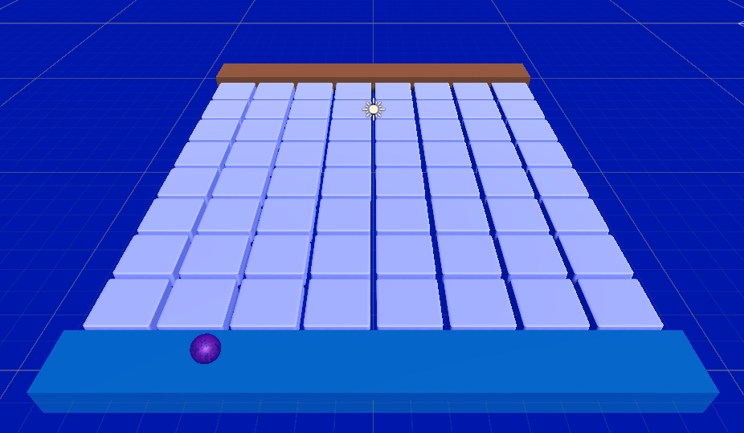
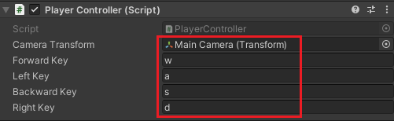
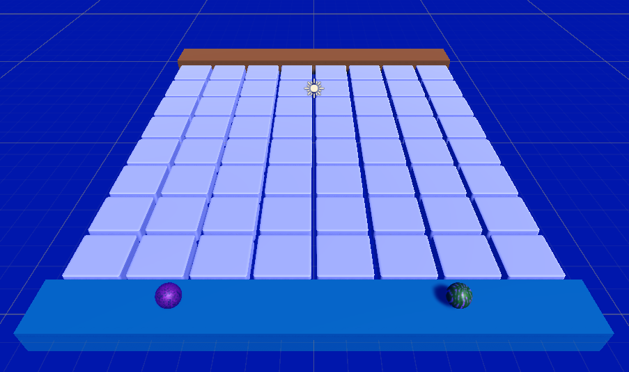
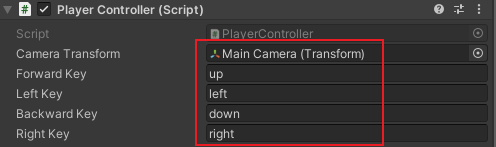
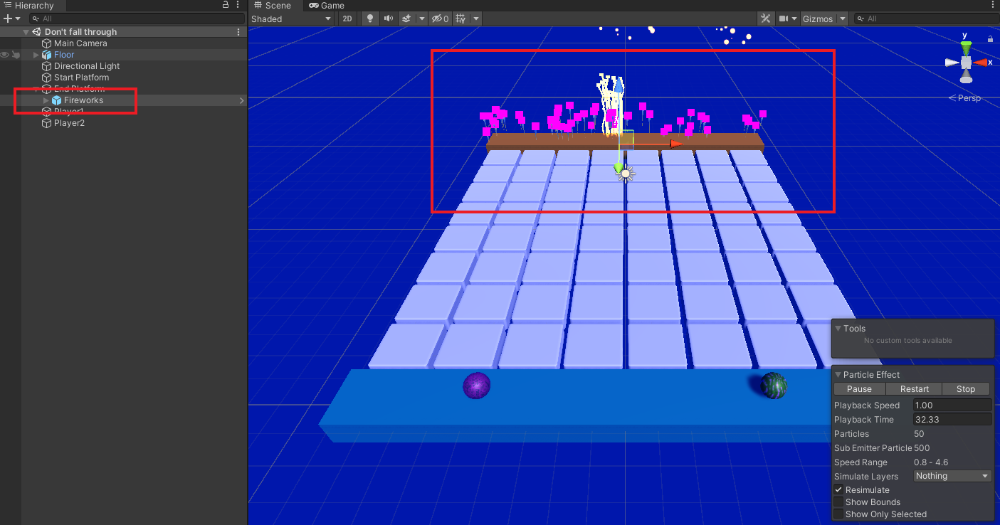
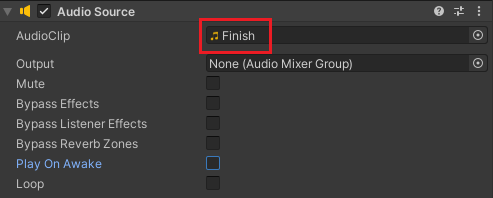

## Add the players

In this step you will add two spheres with different materials for the two players and scripts to allow the players to be moved with different keys. When the first player reaches the end platform a particle effect will trigger.

<video width="640" height="360" controls preload="none" poster="images/fireworks-win.png">
<source src="images/fireworks-win.mp4" type="video/mp4">
Your browser does not support WebM video, try FireFox or Chrome
</video>

### Create the first player

--- task ---

Create a sphere and name it 'Player1'.

--- /task ---

--- task ---

Set the Transform Scale to X=`0.8`, Y=`0.8`, Z=`0.8`. 

Position the sphere on the left side of the start platform. Our example uses the Transform Position of: X=`-4.5`, Y=`1`, Z=`-10`.

--- /task ---

--- task ---

Choose a material for the player and drag it on to the sphere in the Scene view. 

--- /task ---

--- task ---

Add the RigidBody component to the 'Player1' GameObject.

--- /task ---

--- task ---

Add a new script called 'PlayerController' to the 'Player1' GameObject:

--- code ---
---
language: cs
filename: PlayerController.cs
line_numbers: true
line_number_start: 1
line_highlights: 
---

using System.Collections;
using System.Collections.Generic;
using UnityEngine;

public class PlayerController : MonoBehaviour
{
    public Transform cameraTransform;
    public string forwardKey;
    public string leftKey;
    public string backwardKey;
    public string rightKey;
    private Rigidbody rb;
    
    // Start is called before the first frame update
    void Start()
    {
        rb = this.GetComponent<Rigidbody>();
        rb.transform.forward = cameraTransform.forward;
    }

    // FixedUpdate is called once per fixed frame-rate frame
    void FixedUpdate()
    {
        // Calculates cameraTransform.forward without the y value so the ball doesn't move up and down on the Y axis
        Vector3 forward = new Vector3(cameraTransform.forward.x, 0, cameraTransform.forward.z).normalized;
        Vector3 right = Quaternion.AngleAxis(90, Vector3.up) * forward;
        Vector3 left = -right;
        Vector3 backward = -forward;

        if (Input.GetKey(forwardKey))
        {
            rb.AddForce(forward * 10f);
        }

        if (Input.GetKey(rightKey))
        {
            rb.AddForce(right * 5f);
        }

        if (Input.GetKey(backwardKey))
        {
            rb.AddForce(backward * 2f);
        }

        if (Input.GetKey(leftKey))
        {
            rb.AddForce(left * 5f);
        }
    }
}

--- /code ---

--- /task ---

--- task ---

Select the 'Player1' GameObject to view the 'Inspector' options.

Drag the 'Main Camera' game object to the 'Camera Transform' variable in the 'Inspector'. 

Set the 'Forward Key', 'Left Key', 'Backward Key', and 'Right Key' to the lowercase letters that you want to use to control Player1. We used 'w', 'a', 's' and 'd'.

**Tip:** The letters for the keys need to be in lower case. 

--- /task ---

--- task ---

**Test:** Play the game and check that you can control the sphere with the keys that you chose. 

Exit play mode. 

--- /task ---

### Add a second player

--- task ---

Duplicate Player1 to create a Player2 GameObject. 

Move Player2 to a different position on the start platform, Position: (4.5, 1 -10).

Drag a different material to Player2 in the scene view. 

--- /task ---

--- task ---

**Test:** Play your game and use the keys you chose to move Player1. Player2 will also move! That's not what we want. 

Exit Play mode.

--- /task ---

--- task ---

Select the Player2 GameObject and find the 'PlayerController' script in the inspector. 

Change the Player2 keys to use the arrow keys: `up`, `left`, `down`, and `right`. 

--- /task ---

--- task ---

**Test:** Play your game and use the arrow keys to move Player2.

Exit Play mode.

--- /task ---

### Trigger a particle effect for the winner

--- task ---

Add the 'Player' tag to Player1 and Player2. 

--- /task ---

--- task ---

In the 'Project' window, navigate to 'Assets -> Particle Systems'.

Drag the 'Fireworks' particle system onto the 'End Platform' GameObject in the Hierarchy window. 

--- /task ---

--- task ---

Select the 'End Platform' GameObject and go to the 'Inspector' window. 

Add an AudioSource component.

**Uncheck** 'Play On Awake'.

--- /task ---

--- task ---

In the 'Project' window, navigate to 'Assets -> Sounds'. 

Find a tune that you like from the 'Effects' or 'ShortTunes' folders. 

With the 'End Platform' selected, drag your chosen sound onto the 'AudioClip' source. This example uses the 'Finish' sound from the 'ShortTunes' folder. 

--- /task ---

--- task ---

With the 'End Platform' GameObject selected. Go to the 'Inspector' window and add a new script component called 'FinishEffects'.

--- /task ---

--- task ---

Open the 'FinishEffects' script and enter the following code to play a sound and a fireworks effect when a player reaches the end platform. 

--- code ---
---
language: cs
filename: FinishEffects.cs
line_numbers: true
line_number_start: 1
line_highlights: 
---

using System.Collections;
using System.Collections.Generic;
using UnityEngine;

public class FinishEffects : MonoBehaviour
{
   AudioSource audioSource;
   ParticleSystem completeParticleSystem;

   void Start()
   {
       completeParticleSystem = GetComponentInChildren<ParticleSystem>();
       audioSource = this.gameObject.GetComponent<AudioSource>();
   }

   void OnCollisionEnter(Collision other)
   {
       if (other.gameObject.tag == "Player")
       {
           completeParticleSystem.GetComponent<ParticleSystemRenderer>().material = other.gameObject.GetComponent<Renderer>().material;
           completeParticleSystem.Play();
           audioSource.Play();
       }
   }
}

--- /code ---

--- /task ---

--- task ---

**Test:** Play your game and roll one of the balls to the end platform. This will set off the fireworks and play the tune. 

What happens if you roll the second ball to the end platform? 

Exit Play mode.

--- /task ---

--- task ---

Edit the `FinishEffects` code to only trigger when the first player reaches the end platform:

--- code ---
---
language: cs
filename: FinishEffects.cs
line_numbers: true
line_number_start: 1
line_highlights: 9, 19, 21
---
using System.Collections;
using System.Collections.Generic;
using UnityEngine;

public class FinishEffects : MonoBehaviour
{
   AudioSource audioSource;
   ParticleSystem completeParticleSystem;
   bool winner = false;

   void Start()
   {
       completeParticleSystem = GetComponentInChildren<ParticleSystem>();
       audioSource = this.gameObject.GetComponent<AudioSource>();
   }

   void OnCollisionEnter(Collision other)
   {
       if (other.gameObject.tag == "Player" && winner == false)
       {
           winner = true;
           completeParticleSystem.GetComponent<ParticleSystemRenderer>().material = other.gameObject.GetComponent<Renderer>().material;
           completeParticleSystem.Play();
           audioSource.Play();
       }
   }
}

--- /code ---

--- /task ---

--- task ---

**Test:** Play your game and roll one of the balls to the end platform. Then roll the second ball. 

What happens now when the second ball reaches the end platform? 

Exit Play mode.

<video width="640" height="360" controls preload="none" poster="images/fireworks-win.png">
<source src="images/fireworks-win.mp4" type="video/mp4">
Your browser does not support WebM video, try FireFox or Chrome
</video>

--- /task ---