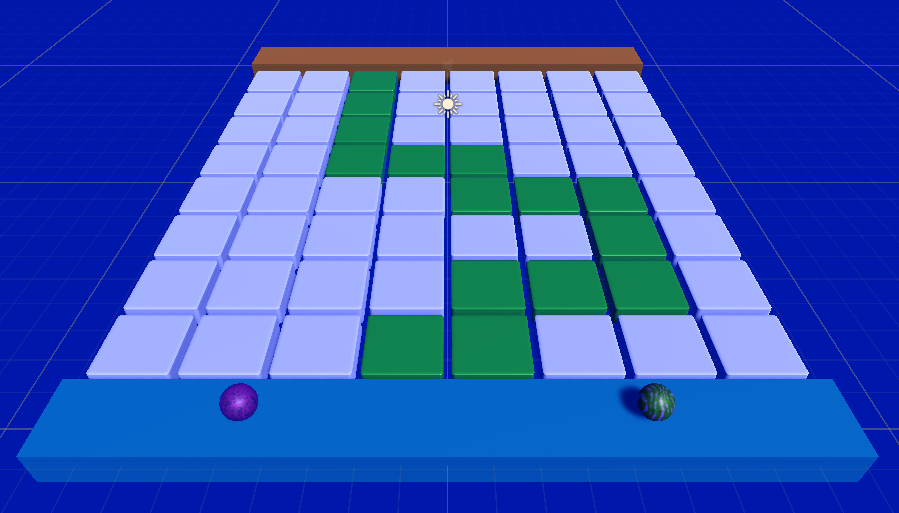
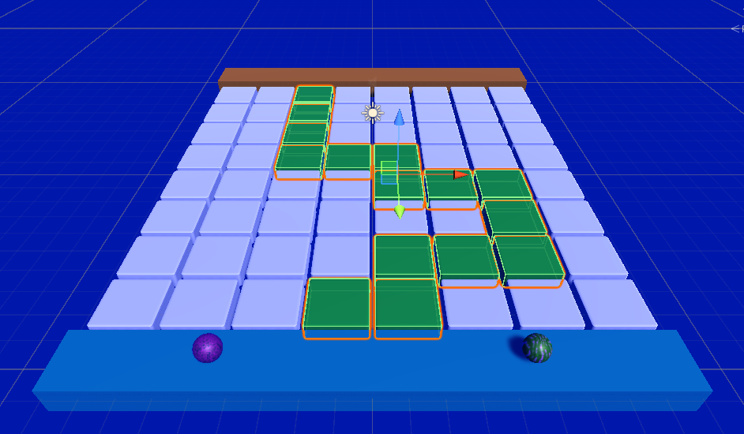

## Create a safe route

In this step you will create a safe route from the start to the end platform. Rolling over a safe tile will turn it green. 

{:width="300px"}

### Use the Scene view to plan your path.

--- task ---

**Choose:** a 'safe' material to cover the safe tiles. We used 'Gloss green'.

**Design** a safe path. Drag the safe material to the safe tiles to see your route.

**Tip:** the safe path should make a route from the start platform to the end platform. The safe tiles need to form a connected path but you can have some decoy tiles.  

--- /task ---

--- task ---

**Test:** Play your game. Notice that the safe tiles are not coloured in your safe material. This is because your TileController script sets the tile material.  

--- /task ---

--- task ---

In the Inspector, click on the tag dropdown and choose ‘Add Tag…’. Add a new Tag called "Safe".

**Tip:** It doesn't matter which objects you have selected when you create a new tag. 

--- /task ---

--- task ---

Go to the Scene view and select all the 'Safe' tiles. 

**Tip:** Hold down the <kbd>ctrl<kbd> / <kbd>cmd<kbd> key then click on the safe tiles in turn to highlight all the tiles in the path. 

Selected tiles are shown with an orange border:

--- /task ---

--- task ---

Apply the 'Safe' tag to the safe tiles.

--- /task ---

--- task ---

Edit the 'TileController' script to reveal the safe material when a player rolls across a safe tile: 

--- code ---
---
language: cs
filename: TileController.cs
line_numbers: true
line_number_start: 1
line_highlights: 8, 17-20
---
using System.Collections;
using System.Collections.Generic;
using UnityEngine;
public class TileController : MonoBehaviour
{
    private Renderer rend;
    public Material startColour;
    public Material safeColour;

    // Start is called before the first frame update
    void Start()
    {
        rend = GetComponent<Renderer>();
        rend.sharedMaterial = startColour;
    }

  void OnTriggerEnter(Collider other){
       if (gameObject.tag == "Safe"){
           rend.sharedMaterial = safeColour;
       	}
	}
}

--- /code ---

--- /task ---

--- task ---

Save the script and return to the Unity Editor. 

In the Hierarchy window, select **all** the Floor cubes. 

Drag your 'safe' material to the 'Safe Colour' variable. 

--- /task ---

--- task ---

--- /task ---

--- task ---

--- /task ---