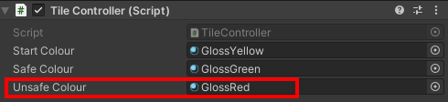
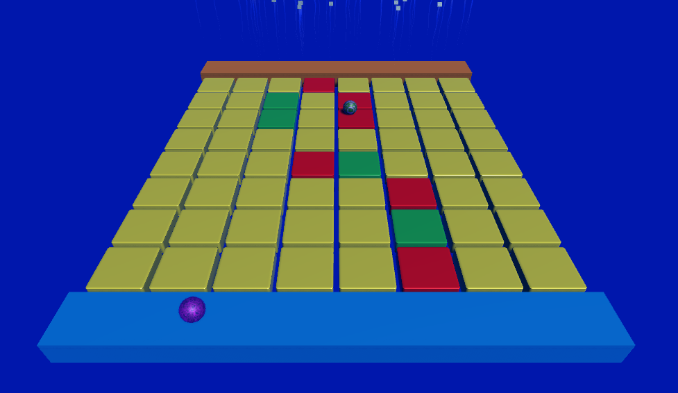

## Fall through

In this step you will make a player fall through the floor if they roll onto a tile that is not on the safe path. The player will reset back to the start so they can have another go and try to beat the other player. 

<video width="640" height="360" controls preload="none" poster="images/unsafe-respawn.png">
<source src="images/unsafe-respawn.mp4" type="video/mp4">
Your browser does not support WebM video, try FireFox or Chrome
</video>

Many popular games have used **collapsing platforms** to add an extra level of challenge. One classic game that introduced falling platforms is **Super Mario Bros**. Released in 1985, this iconic game had players navigating through levels filled with platforms that crumbled beneath Mario's feet. It set the stage for many future games to incorporate this thrilling mechanic including **Sonic the Hedgehog**, **Donkey Kong Country** and **Crash Bandicoot**. Have you played any games that use a collapsing platform mechanic?

--- task ---

Go to your 'TileController' script and add in the highlighted code. This will create an 'Unsafe' colour for your tiles during game play. 

--- code ---
---
language: cs
filename: TileController.cs
line_numbers: true
line_number_start: 1
line_highlights: 9, 22-25
---

using System.Collections;
using System.Collections.Generic;
using UnityEngine;

public class TileController : MonoBehaviour
{  
    public Material startColour;
    public Material safeColour;
    public Material unsafeColour;
    Renderer rend;

    // Start is called before the first frame update
    void Start()
    {
        rend = GetComponent<Renderer>();
        rend.sharedMaterial = startColour;
    }

    void OnTriggerEnter(Collider other){
        if (gameObject.tag == "Safe")
        {
            rend.sharedMaterial = safeColour;
        } 
        else if (gameObject.tag == "Tile")
        {
            rend.sharedMaterial = unsafeColour;
        }
    }
}

--- /code ---

--- /task ---

--- task ---

Save the script and return to the Unity Editor. 

Navigate to the materials folder.

In the Hierarchy window, select **all** the Floor cubes. 

**Choose:** An unsafe material. Drag your 'unsafe' material to the 'Unsafe Colour' variable in the Inspector.  

--- /task ---

--- task ---

**Test:** Play your game. Notice that the tiles not on your safe route turn to your unsafe colour when your ball rolls over them. 

--- /task ---

--- task ---

Go to your 'TileController' script and add in the highlighted code. This will switch 'Gravity' on when an 'Unsafe' tile is rolled over with a player's ball. 

--- code ---
---
language: cs
filename: TileController.cs
line_numbers: true
line_number_start: 1
line_highlights: 17, 18, 29, 30
---

using System.Collections;
using System.Collections.Generic;
using UnityEngine;

public class TileController : MonoBehaviour
{  
    public Material startColour;
    public Material safeColour;
    public Material unsafeColour;
    Renderer rend;

    // Start is called before the first frame update
    void Start()
    {
        rend = GetComponent<Renderer>();
        rend.sharedMaterial = startColour;
        GetComponent<Rigidbody>().useGravity = false;
        GetComponent<Rigidbody>().isKinematic = true;
    }

    void OnTriggerEnter(Collider other){
        if (gameObject.tag == "Safe")
        {
            rend.sharedMaterial = safeColour;
        }
        else if (gameObject.tag == "Tile")
        {
            rend.sharedMaterial = unsafeColour;
            GetComponent<Rigidbody>().useGravity = true;
            GetComponent<Rigidbody>().isKinematic = false;
        }
    }
}

--- /code ---

--- /task ---

--- task ---

**Test:** Play your game. Notice that the tiles not on your safe route turn to your unsafe colour then fall when your ball rolls over them. 

<video width="640" height="360" controls preload="none" poster="images/unsafe-fall.png">
<source src="images/unsafe-fall.mp4" type="video/mp4">
Your browser does not support WebM video, try FireFox or Chrome
</video>

--- /task ---

--- task ---

At the moment, the ball falls with the tile and you need to play your game again to reset it.

Add code to the PlayerController script to respawn the ball at the start platform if it falls to a position of Y < `-10`:

--- code ---
---
language: cs
filename: PlayerController.cs
line_numbers: true
line_number_start: 1
line_highlights: 13, 20, 52-56
---
using System.Collections;
using System.Collections.Generic;
using UnityEngine;

public class PlayerController : MonoBehaviour
{
    public Transform cameraTransform;
    public string forwardKey;
    public string leftKey;
    public string backwardKey;
    public string rightKey;
    Rigidbody rb;
    Vector3 spawnPoint;
    
    // Start is called before the first frame update
    void Start()
    {
        rb = this.GetComponent<Rigidbody>();
        rb.transform.forward = cameraTransform.forward;
        spawnPoint = transform.position;
    }

    // FixedUpdate is called once per fixed frame-rate frame
    void FixedUpdate()
    {
        // Calculates cameraTransform.forward without the y value so the ball doesn't move up and down on the Y axis
        Vector3 forward = new Vector3(cameraTransform.forward.x, 0, cameraTransform.forward.z).normalized;
        Vector3 right = Quaternion.AngleAxis(90, Vector3.up) * forward;
        Vector3 left = -right;
        Vector3 backward = -forward;

        if (Input.GetKey(forwardKey))
        {
            rb.AddForce(forward * 10f);
        }

        if (Input.GetKey(rightKey))
        {
            rb.AddForce(right * 5f);
        }

        if (Input.GetKey(backwardKey))
        {
            rb.AddForce(backward * 2f);
        }

        if (Input.GetKey(leftKey))
        {
            rb.AddForce(left * 5f);
        }

        if (this.transform.position.y < -10)
       {
           rb.velocity = Vector3.zero;
           transform.position = spawnPoint;
       }

    }
}

--- /code ---

The term **respawn** was first used in the context of video games in the iconic first-person shooter game **Doom** released in 1993, where defeated adversaries would reappear in the game world after a certain amount of time. The concept of respawning added a dynamic and challenging element to the gameplay, keeping players on their toes and providing a constant stream of action.

--- /task ---

--- task ---

**Test:** Play your game again. After falling through the hole the player will respawn on the start platform.

<video width="640" height="360" controls preload="none" poster="images/unsafe-respawn.png">
<source src="images/unsafe-respawn.mp4" type="video/mp4">
Your browser does not support WebM video, try FireFox or Chrome
</video>

--- /task ---