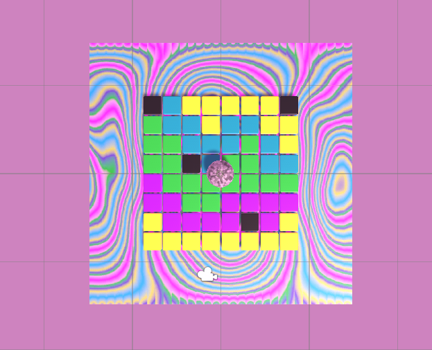

## What next?

If you are following the [More Unity](https://projects.raspberrypi.org/en/raspberrypi/more-unity) path, you can move on to the [Pixel art reveal](https://projects.raspberrypi.org/en/projects/pixel-art-reveal){:target='_blank'} project. In this project, you will design some pixel art which the player reveals by rolling a ball over the tiles.

--- print-only ---

Pixel Art Reveal: https://raspberrypilearning.github.io/unity-webgl/PixelArtReveal

--- /print-only ---

--- no-print ---

<iframe allowtransparency="true" width="710" height="500" src="https://raspberrypilearning.github.io/unity-webgl/PixelArtReveal" scrolling="no" frameborder="0"></iframe>

If you want to have more fun exploring Unity, then you could try out any of [these projects](https://projects.raspberrypi.org/en/projects?software%5B%5D=unity){:target='_blank'} .

If you want to create your own tiled floor, you could try out the [Blender: Create a 3D tiled floor](https://projects.raspberrypi.org/en/projects/blender-tiled-floor){:target='_blank'} project. 

--- /no-print ---